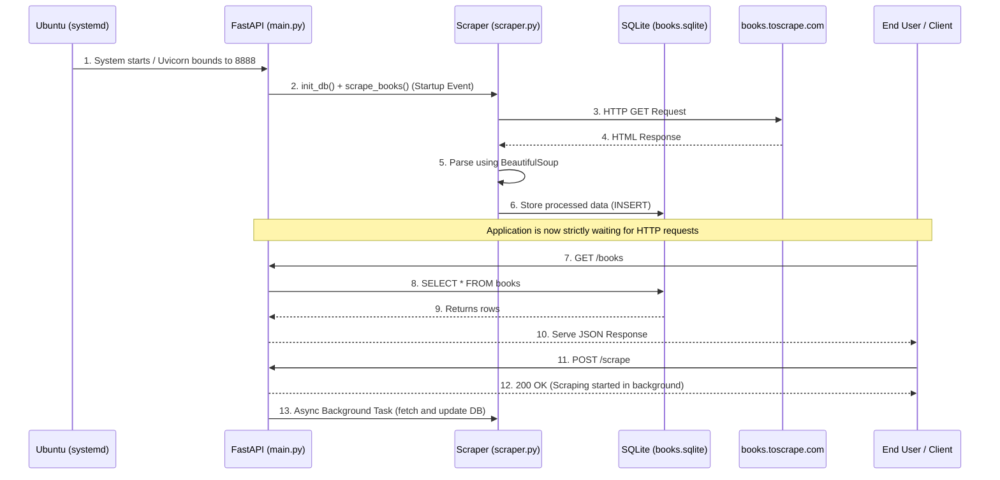

# تحليل نظام تطبيق Book Scraper API

هذا المستند يتضمن التحليل الهيكلي للنظام، ويوضح ترتيب الملفات، وتدفق البيانات المنطقي. يمكنك تصدير هذا المستند كملف PDF ليكافئ المطلوب (التحليل بخط اليد/أو المطبوع).

## 1. ترتيب الملفات (File Organization)
تم تصميم المشروع ليتم توزيعه كحزمة `.deb` لتسهيل التنصيب الآلي، ولذلك اتبعنا الهيكل القياسي لحزم دبيان بجانب بيئة بايثون المعزولة:

```text
book-scraper-api_1.0-1_all/
├── DEBIAN/
│   ├── control       (وصف الحزمة، الاعتماديات مثل ufw, systemd)
│   ├── postinst      (سكريبت ما بعد التنصيب: إنشاء venv وتجهيز الجدار الناري)
│   └── prerm         (سكريبت ما قبل الحذف: إيقاف الخدمات وتنظيف الجدار الناري)
├── lib/systemd/system/
│   └── book-scraper-api.service  (تكوين الخدمة لتعمل في الخلفية تلقائيا)
└── opt/book-scraper-api/         (موقع احتضان الكود)
    ├── main.py       (نقطة الدخول، يحتوي على FastAPI endpoints)
    ├── scraper.py    (كود السكرابنج للاتصال بالموقع وجلب البيانات)
    ├── requirements.txt
    └── venv/         (يُبنى أثناء التنصيب لعزل الحزم)
```

**لماذا هذا التصميم؟**
- **الفصل المنطقي (Separation of Concerns):** تم فصل عملية جلب البيانات (`scraper.py`) عن عملية واجهة برمجة التطبيقات (`main.py`). هذا يسمح لكلا العمليتين بالتطور دون التأثير على الأخرى.
- **التغليف المعزول (Isolation):** استخدام المجلد `/opt` مع الـ `venv` يمنع تضارب الحزم مع النظام الأساسي في أوبنتو.
- **الأتمتة (Automation):** ملفات البيئة (`postinst` و `prerm`) تضمن أن مدير النظام الدبياني سيطابق الإعدادات تلقائياً (ufw و systemd) بدون تدخل بشري.

## 2. تدفق البيانات (Data Flow)
إليك كيف تنتقل البيانات داخل النظام منذ لحظة تشغيله:



**شرح التدفق:**
1. عندما يعمل خادم أوبنتو، يقوم مدير الخدمات `systemd` بتشغيل التطبيق تلقائيا بناءً على ملف الـ `.service`.
2. يتم تشغيل `uvicorn` لخدمة التطبيق، وبناءً على أحداث الـ `lifespan` في FastAPI، يتم التأكد من وجود قاعدة البيانات ويتم إطلاق مهمة مبدئية لجمع البيانات.
3. يقوم الويب سكرابر بإرسال طلب HTTP إلى الموقع الهدف `toscrape.com`.
4. بعد استلام الـ HTML للرد، يقوم بتنظيف وترتيب البيانات باستخدام مكتبة `BeautifulSoup`.
5. يتم حفظ هذه البيانات المنظمة في قاعدة بيانات محلية مرنة خفيفة `SQLite` لكي تُستدعى بسرعة عند الطلب بدون الحاجة للسكرابنج في كل مرة (Caching).
6. عندما يتصل العميل بالتطبيق (عبر البورت 8888 المفتوح عبر الجدار الناري `ufw`) باستخدام مسار `/books`، يقرأ التطبيق البيانات جاهزة وسريعة من قاعدة البيانات ويعيدها بصيغة JSON.
7. في حال أراد المستخدم تحديث البيانات، يمكنه إرسال POST إلى `/scrape` ليتم تشغيل السكرابنج في الـ Background بدون تعطيل الخدمة الأساسية.

هذا التصميم يوفر تطبيقاً **مرنًا** قادرًا على تحمل ضغط القراءات المتكررة لأنه يخدم البيانات من الذاكرة المحلية، وهو **موثوق** لأنه يعزل الأخطاء (سواء في السكرابنج أو الاتصال) عن تقديم الخدمات، وهو **تلقائي** تمامًا من منظور السيرفر.
