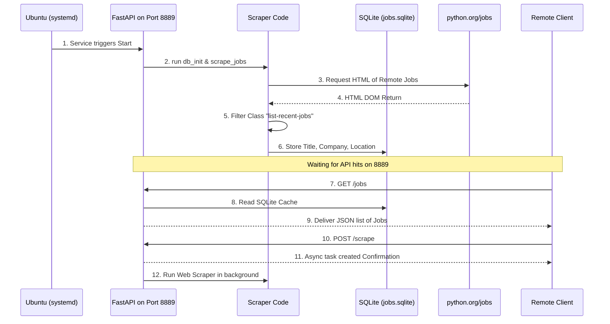

# تحليل نظام تطبيق Remote Job Scraper API

هذا المستند يوضح التحليل الهيكلي لمشروع جلب بيانات الوظائف عن بُعد، ويمكن تصديره لـ PDF لتسليمه كتحليل (مكافئ للمطلوب خطياً).

## 1. ترتيب الملفات (File Organization)
بما أنه تم طلب بناء المشروع بنفس البنية القوية للمشروع السابق ولكن بشكل منفصل، تم اختيار البورت `8889` ليعملا سوية على نفس الخادم بدون تعارض.

```text
remote-job-scraper-api_1.0-1_all/
├── DEBIAN/
│   ├── control       (وصف الحزمة واعتمادياتها)
│   ├── postinst      (ملف ما بعد التنصيب: تجهيز البورت 8889)
│   └── prerm         (إغلاق المنفذ والخدمة)
├── lib/systemd/system/
│   └── remote-job-scraper-api.service  (تكوين الخدمة للإقلاع التلقائي)
└── opt/remote-job-scraper-api/
    ├── main.py       
    ├── scraper.py    
    ├── requirements.txt
    └── venv/         
```

**لماذا هذا التصميم؟**
- **الفصل الكلي:** تشغيل السيرفرين (الكتب والوظائف) معزولين تماما ويملكان قواعد بيانات مستقلة مما يعني اعتمادية عالية وعدم تداخل.
- **الأتمتة الكاملة:** كل شيء يُعَد تلقائيًا؛ من عزل البايثون في حزمة `opt` وحتى فتح منافذ الاتصال في `ufw` من خلال أدوات التحكم الخاصة بـ Debian.

## 2. تدفق البيانات (Data Flow)



**شرح التدفق:**
تتأكد الإدارة المركزية `systemd` من بقاء الخدمة حية. في لحظة الانطلاق يبدأ السكرابينج عن طريق الاتصال بموقع وظائف بايثون لاستخلاص المسميات والشركات والمواقع (التي غالبا تكون Remote).
عملية الحفظ في `SQLite` تعني خفة لا مثيل لها وقدرة عالية على توفير البيانات للطلب المتكرر لـ `/jobs` دون الرجوع لموقع الوظائف وإرهاقه (تقليل حظر الآي بي). 
في حال دعت الحاجة يمكن إرسال `POST /scrape` لجلب أحدث الوظائف المنشورة بصمت ومن خلف الكواليس دون إيقاف خدمة القراءة من الـ Database.
