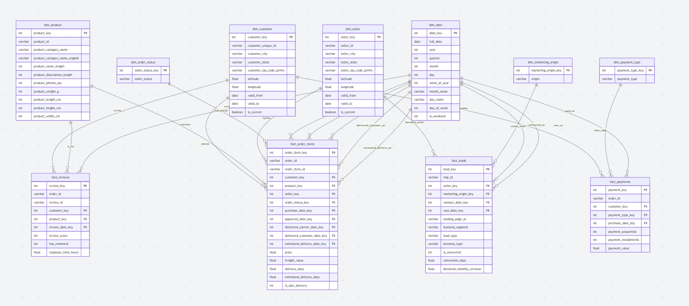

# Olist E-Commerce Data Warehouse — Documentation

## Table of Contents

1. [Architecture Overview](#1-architecture-overview)
2. [Data Model](#2-data-model)
3. [Pipeline Design](#3-pipeline-design)
4. [Data Quality Handling](#4-data-quality-handling)
5. [Performance Optimization](#5-performance-optimization)
6. [Key Assumptions](#6-key-assumptions)
7. [Trade-offs](#7-trade-offs)
8. [How to Run](#8-how-to-run)

---

## 1. Architecture Overview

### Architecture Choice: Kimball Dimensional Model (Galaxy / Fact Constellation Schema)

We chose the **Kimball dimensional modeling** approach for this data warehouse, resulting in a **Galaxy Schema** (also called a **Fact Constellation Schema**). Here's why — and why not the alternatives:

**Star vs. Galaxy — What's the Difference?**

| Schema | Structure | When to Use |
|---|---|---|
| **Star** | 1 fact table + N dimension tables | Single business process |
| **Galaxy / Constellation** | M fact tables + N shared dimensions | Multiple business processes sharing conformed dimensions |
| **Snowflake** | Normalized (split) dimensions | When storage matters more than query speed |

Our DWH has **4 fact tables** (`fact_order_items`, `fact_payments`, `fact_reviews`, `fact_leads`) that share **conformed dimensions** (`dim_customer`, `dim_date`, `dim_seller`, etc.). Each fact table forms its own star, and the shared dimensions link them into a constellation — hence, **Galaxy Schema**.

| Criterion | Kimball Galaxy (Chosen) | Inmon | Medallion |
|---|---|---|---|
| **Complexity** | Low-Medium — flat dims, multiple facts | High — 3NF + star views | Medium — 3 layers |
| **Query Performance** | Optimized (fewer joins per star) | Requires many joins | Good but more overhead |
| **Best for** | Multi-process OLAP | Enterprise integration | Streaming / lakehouse |
| **Implementation time** | Days | Weeks | Days-Weeks |
| **Infrastructure** | Minimal | Substantial | Cloud-oriented |

**Why Kimball wins here:**

1. **Single source** — We have one SQLite database, not 50 operational systems. Inmon's enterprise bus architecture is overkill.
2. **Analytical focus** — The business needs are purely analytical (sales trends, customer segmentation, delivery KPIs). Star schemas are purpose-built for this.
3. **Performance** — Star schemas minimize joins in analytical queries. A sales trend query hits exactly 2 tables (fact + dim_date), not 5+ normalized tables.

**Why not Medallion?** The Medallion architecture (Bronze/Silver/Gold) is designed for data lakes with streaming data, multiple raw sources, and cloud-native infrastructure (Databricks, Delta Lake). Our static SQLite dataset doesn't benefit from this complexity.

### Architecture Diagram

```
  ┌─────────────────────────────────────────────────────────────────┐
  │                        SOURCE LAYER                             │
  │  ┌───────────────────────────────────────────────────────────┐  │
  │  │              olist.sqlite (11 tables)                     │  │
  │  │  orders | order_items | customers | products | sellers    │  │
  │  │  order_payments | order_reviews | geolocation             │  │
  │  │  product_category_name_translation                        │  │
  │  │  leads_qualified | leads_closed                           │  │
  │  └───────────────────────────────────────────────────────────┘  │
  └──────────────────────────────┬──────────────────────────────────┘
                                 │
                                 v
  ┌─────────────────────────────────────────────────────────────────┐
  │                   PostgreSQL ELT PIPELINE                       │
  │                                                                 │
  │  ┌─────────────────────┐    ┌──────────────────────────────┐    │
  │  │  extract_load.py    │    │  SQL Scripts (01-11)         │    │
  │  │  SQLite -> staging  │───>│  staging -> dwh schema       │    │
  │  │  via pandas/psycopg2│    │  PostgreSQL-native SQL       │    │
  │  └─────────────────────┘    └──────────────────────────────┘    │
  └──────────────────────────────┬──────────────────────────────────┘
                                 │
                                 v
  ┌─────────────────────────────────────────────────────────────────┐
  │              PostgreSQL: olist_dwh database                     │
  │                                                                 │
  │  │  staging schema     │    │  dwh schema (Galaxy Schema) │     │
  │  │  (raw source data)  │    │                             │     │
  │  ┌─────────────────────┐    ┌─────────────────────────────┐     │
  │  │  11 tables          │    │  DIMENSIONS:                │     │
  │  └─────────────────────┘    │  dim_date, dim_customer     │     │ 
  │                             │  dim_product, dim_seller    │     │
  │                             │  dim_payment_type           │     │
  │                             │  dim_order_status           │     │
  │                             │                             │     │
  │                             │  FACTS (4 stars = galaxy):  │     │
  │                             │  fact_order_items           │     │
  │                             │  fact_payments              │     │
  │                             │  fact_reviews               │     │
  │                             │  fact_leads                 │     │
  │                             └─────────────────────────────┘     │
  └──────────────────────────────┬──────────────────────────────────┘
                                 │
                                 v
  ┌─────────────────────────────────────────────────────────────────┐
  │                      REPORTING LAYER                            │
  │  10 Analytical Queries (queries.sql)                            │
  │  Sales trends | Customer value | Delivery | Products | Leads    │
  └─────────────────────────────────────────────────────────────────┘
```

---

## 2. Data Model

### Business Processes Identified

We identified **4 distinct business processes**, each represented by a fact table:

| # | Business Process | Fact Table | Grain | Why Separate? |
|---|---|---|---|---|
| 1 | **Order Sales** | `fact_order_items` | 1 row per order line item | Core revenue fact — most granular sales data |
| 2 | **Payments** | `fact_payments` | 1 row per payment transaction | Orders can have multiple payment methods |
| 3 | **Reviews** | `fact_reviews` | 1 row per review | Reviews are at order level, not item level |
| 4 | **Seller Acquisition** | `fact_leads` | 1 row per qualified lead | Completely different business process and grain |

### Why Not Combine Facts?

A common mistake is cramming everything into one fact table. Here's why we don't:

- **fact_order_items vs fact_payments**: An order with 2 items and 2 payment methods would create 4 rows if combined (cross join), incorrectly inflating both revenue and payment amounts.
- **fact_order_items vs fact_reviews**: Reviews are at the order level (1 review per order), while items are at the line-item level. Combining would duplicate review scores across items.
- **fact_leads**: Entirely different grain (leads, not orders), different dimensions, different users.

### Dimension Tables

| Dimension | Rows | Key Design Decision |
|---|---|---|
| `dim_date` | 864 | Generated calendar (not extracted). Covers Aug 2016 – Dec 2018 with buffer. Integer `date_key` (YYYYMMDD) for fast range filters. |
| `dim_customer` | 96,356 | **SCD Type 2**. Tracks historical geographic location changes using `valid_from` and `valid_to`. |
| `dim_product` | 32,952 | Merges English category translations. 610 NULL categories → "Unknown". |
| `dim_seller` | 3,096 | **SCD Type 2**. Enriched with avg lat/lng from geolocation table. |
| `dim_payment_type` | 6 | Lookup: credit_card, boleto, voucher, debit_card, other, unknown |
| `dim_order_status` | 9 | Lookup: delivered, shipped, canceled, unavailable, invoiced, processing, created, approved, unknown |
| `dim_marketing_origin` | 11 | Extracted from fact_leads to prevent degenerate dimension |

### Galaxy Schema Diagram



### Grain Definitions

**Grain** is the most critical decision in dimensional modeling. Getting it wrong means incorrect aggregations.

| Fact Table | Grain Statement | Primary Key |
|---|---|---|
| `fact_order_items` | "One row per product line item in an order" | `order_item_key` (surrogate) = `order_id + order_item_id` (natural) |
| `fact_payments` | "One row per payment transaction within an order" | `payment_key` (surrogate) = `order_id + payment_sequential` (natural) |
| `fact_reviews` | "One row per customer review" | `review_key` (surrogate) = `review_id` (natural) |
| `fact_leads` | "One row per marketing-qualified lead" | `lead_key` (surrogate) = `mql_id` (natural) |

### Relationships

#### Fact-to-Dimension: All M:1 (Many-to-One)

In a dimensional model, **every fact-to-dimension relationship is M:1** -- many fact rows reference one dimension row. This is by design: the fact table sits at the most granular level, and each foreign key points to exactly one dimension record.

| Fact Table | Dimension | Cardinality | Meaning |
|---|---|---|---|
| `fact_order_items` -> `dim_customer` | **M:1** | Many order items belong to one customer |
| `fact_order_items` -> `dim_product` | **M:1** | Many order items reference one product |
| `fact_order_items` -> `dim_seller` | **M:1** | Many order items sold by one seller |
| `fact_order_items` -> `dim_date` | **M:1** | Many order items purchased on one date |
| `fact_order_items` -> `dim_order_status` | **M:1** | Many order items share one order status |

---

| Fact Table | Dimension | Cardinality | Meaning |
|---|---|---|---|
| `fact_payments` -> `dim_customer` | **M:1** | Many payments made by one customer |
| `fact_payments` -> `dim_payment_type` | **M:1** | Many payments use one payment type |
| `fact_payments` -> `dim_date` | **M:1** | Many payments on one purchase date |

---

| Fact Table | Dimension | Cardinality | Meaning |
|---|---|---|---|
| `fact_reviews` -> `dim_customer` | **M:1** | Many reviews written by one customer |
| `fact_reviews` -> `dim_product` | **M:1** | Many reviews about one product |
| `fact_reviews` -> `dim_date` | **M:1** | Many reviews created on one date |

---

| Fact Table | Dimension | Cardinality | Meaning |
|---|---|---|---|
| `fact_leads` -> `dim_seller` | **M:1** | Many leads convert to one seller (nullable) |
| `fact_leads` -> `dim_date` (contact) | **M:1** | Many leads contacted on one date |
| `fact_leads` -> `dim_date` (won) | **M:1** | Many leads won on one date (nullable) |

**Total: 14 relationships, all M:1.**

#### Why No M:M (Many-to-Many)?

M:M relationships don't exist in a properly designed dimensional model because:

1. **Fact tables already resolve M:M** -- In the source data, orders-to-payments is M:M (one order can have multiple payments, and payment types appear across many orders). The `fact_payments` table resolves this by having **one row per payment transaction**, turning M:M into M:1 with `dim_payment_type`.

2. **Bridge tables would be needed otherwise** -- If we had a M:M between products and categories (e.g., a product in multiple categories), we'd need a bridge table. In our case, each product has exactly one category, so no bridge is needed.

| Source Relationship | How We Resolved It | DWH Result |
|---|---|---|
| Order <-> Payments (M:M) | Separate `fact_payments` at payment-transaction grain | M:1 to `dim_payment_type` |
| Order <-> Items (1:M) | `fact_order_items` at line-item grain | M:1 to all dims |
| Order <-> Reviews (1:1) | Separate `fact_reviews` at review grain | M:1 to dims |
| Customer <-> Orders (1:M) | Deduplicated via `customer_unique_id` in `dim_customer` | M:1 from facts |

#### Why No 1:1 (One-to-One)?

1:1 relationships are absent by design:

- **If two tables had a 1:1 relationship, they should be merged** into one table. Keeping them separate wastes a join for no benefit.
- Example: If `dim_customer` had a 1:1 with a `dim_customer_geo` table, we'd just add `latitude` and `longitude` columns directly into `dim_customer` (which is exactly what we did).

#### Cross-Fact Relationships (via Conformed Dimensions)

The 4 fact tables don't join directly to each other. Instead, they connect **through shared (conformed) dimensions**:

```
  fact_order_items ---- dim_customer ---- fact_payments
         |                   |                  |
         |                   |                  |
    dim_product         dim_date          dim_payment_type
         |                   |
         |                   |
  fact_reviews          fact_leads ---- dim_seller
```

| Cross-Fact Query | Connected Via | Example |
|---|---|---|
| "Revenue vs. Payment Method" | `dim_customer` + `order_id` | Join fact_order_items and fact_payments on order_id |
| "Product Revenue vs. Review Score" | `dim_product` | Both facts have `product_key` |
| "Customer Orders vs. Review Behavior" | `dim_customer` | Both facts have `customer_key` |
| "Lead Conversion vs. Seller Performance" | `dim_seller` | fact_leads and fact_order_items share `seller_key` |

This is the power of **conformed dimensions** in a Galaxy Schema -- they enable cross-process analysis without denormalization.

---

## 3. Pipeline Design

### PostgreSQL ELT Pipeline

**Philosophy**: Separate "load" from "transform". Load raw data first (EL), then transform using SQL inside the database. This is the modern industry ELT pattern used by dbt, Snowflake, and BigQuery workflows — applied here to PostgreSQL.

**Why ELT over ETL?**

- Transforms run inside the database engine, leveraging PostgreSQL's optimizer
- SQL scripts are version-controllable, auditable, and reviewable
- No data leaves the database during transformation (no memory pressure)
- Same pattern scales to cloud DWH platforms (Snowflake, BigQuery, Redshift)

```
┌───────────────────────────────────────────────────────────┐
│  extract_load.py                                          │
│  - Auto-creates database + schemas (staging, dwh)         │
│  - Reads SQLite via pandas, writes to PostgreSQL staging  │
│  - Chunked writes (5000 rows) for memory efficiency       │
│  - Uses SQLAlchemy engine + psycopg2 driver               │
└───────────────────────┬───────────────────────────────────┘
                        │
                        v
┌───────────────────────────────────────────────────────────┐
│  SQL Scripts (01-11, PostgreSQL dialect)                   │
│  01: dim_date (generated calendar via generate_series)    │
│  02: dim_customer (DISTINCT ON dedup + geo + INITCAP)     │
│  03: dim_product (category translation + COALESCE)        │
│  04: dim_seller (geo enrichment)                          │
│  05: dim_payment_type (lookup)                            │
│  06: dim_order_status (lookup)                            │
│  07: fact_order_items (primary sales + delivery metrics)  │
│  08: fact_payments                                        │
│  09: fact_reviews                                         │
│  10: fact_leads                                           │
│  11: indexes (PKs, B-tree indexes, ANALYZE)               │
└───────────────────────┬───────────────────────────────────┘
                        │
                        v
┌───────────────────────────────────────────────────────────┐
│  Validation                                               │
│  - Row count checks for all 10 tables                     │
│  - Revenue reconciliation (source vs target)              │
│  - Referential integrity checks (FK lookups)              │
└───────────────────────────────────────────────────────────┘
```

**Key characteristics:**

- **ELT pattern**: raw data lands in `staging` schema, transforms produce the galaxy schema in `dwh` schema
- **Schema separation**: raw source data (`staging.*`) is isolated from analytical tables (`dwh.*`)
- **Credentials via `.env`**: passwords never hardcoded in source code
- **Real PRIMARY KEY constraints**: enforced by PostgreSQL (not just application-level)
- **B-tree indexes**: on all date keys, dimension FKs, and business keys
- **`ANALYZE`**: updates PostgreSQL query planner statistics for optimal execution plans
- **Idempotent**: safe to re-run — all scripts use `DROP IF EXISTS + CREATE`
- **Error handling**: structured logging, phase timing, and validation after each step

---

## 4. Data Quality Handling

| Issue | Impact | Resolution | Justification |
|---|---|---|---|
| **610 products without category** (1.9%) | Missing in category analysis | Set to "Unknown" | Preserves the data for revenue/delivery analysis; the category is just unknown, not invalid |
| **13 categories without English translation** | Missing in English reports | Use Portuguese name as fallback | Better to show the original name than lose the data |
| **2,965 orders without delivery date** (3.0%) | Missing delivery metrics | Keep as NULL; exclude from delivery KPIs via `WHERE` filters | These are non-delivered orders (shipped/processing); forcing a value would be misleading |
| **160 orders never approved** (0.2%) | `-1` in approved_date_key | Keep and flag | These are edge cases (possibly payment failures); useful for operational analysis |
| **customer_id vs customer_unique_id** | 99,441 IDs vs 96,096 unique customers | Use `customer_unique_id` as business key | customer_id is a per-order identifier; customer_unique_id correctly identifies repeat buyers |
| **Geolocation duplicates** | 1M rows for 19K zip codes | Average lat/lng per zip_code_prefix | Multiple readings per zip code; average gives best central point |
| **`not_defined` payment type** (3 rows) | Unclear category | Map to "other" | Too few rows to warrant investigation; "other" is semantically appropriate |
| **Leads sparse fields** (92%+ NULLs) | has_company, has_gtin, average_stock | Excluded from DWH | Including 92%-NULL columns adds no analytical value and bloats the schema |

---

## 5. Performance Optimization

### Indexing Strategy

We created **25+ indexes** across all tables, targeting the most common analytical query patterns:

| Index Target | Tables | Query Pattern Served |
|---|---|---|
| `date_key` columns | All facts | Time-series filtering (most common) |
| `customer_key` | fact_order_items, fact_payments, fact_reviews | Customer-level aggregations |
| `product_key` | fact_order_items, fact_reviews | Product/category analysis |
| `seller_key` | fact_order_items | Seller performance dashboards |
| `order_id` | fact_order_items, fact_payments | Order-level lookups |
| Dimension PKs + BKs | All dims | Join performance + deduplication |

### PostgreSQL-Specific Optimizations

- **`ANALYZE` after indexing**: Updates the query planner's row/column statistics so it can choose optimal execution plans (index scan vs. seq scan, join order, etc.)
- **B-tree indexes**: PostgreSQL's default index type excels at both point lookups AND range scans (e.g., `WHERE purchase_date_key BETWEEN 20170101 AND 20171231`)
- **Real PRIMARY KEY constraints**: Not just logical — PostgreSQL enforces uniqueness at the storage level, providing guaranteed data integrity
- **Data loaded before indexing**: Tables are populated first, then indexes are created. This is faster than maintaining indexes during INSERT

### Why Not Partition?

With ~100K orders spanning 2 years, physical partitioning would add complexity without benefit:

- The entire fact_order_items table (112K rows) fits comfortably in memory
- B-tree indexes on date_key are sufficient for range filtering
- PostgreSQL's table statistics (via `ANALYZE`) already guide the planner to optimal plans

**For production scale** (millions of rows), we would use PostgreSQL's declarative partitioning on `purchase_date_key` with monthly range partitions.

### Pre-calculated Metrics

The fact tables include pre-calculated derived fields to avoid repeated computation:

- `delivery_days`: `(delivered_date - purchase_date)` in days
- `estimated_delivery_days`: `(estimated_date - purchase_date)` in days
- `is_late_delivery`: boolean flag (`delivered > estimated`)
- `has_comment`: boolean flag on reviews
- `response_time_hours`: time between review creation and response
- `conversion_days`: lead contact-to-close time
- `is_converted`: boolean flag on leads

This trades storage space for query speed — a deliberate and standard DWH optimization.

---

## 6. Key Assumptions

1. **Static dataset**: The Olist dataset is a historical snapshot (Sep 2016 – Oct 2018). We designed for full-refresh batch loading, not incremental/CDC.

2. **customer_unique_id is reliable**: We trust this field to correctly identify repeat customers across orders.

3. **Review-to-product mapping**: When an order has multiple items, we link the review to the first item's product. This is a simplification — the customer may be reviewing any or all items.

4. **Geolocation averaging**: Multiple lat/lng readings per zip code are averaged. This gives the geographic centroid, which is sufficient for regional analysis.

5. **Currency is BRL**: All monetary values are in Brazilian Reais (R$). No currency conversion is needed.

6. **Leads are independent**: The leads funnel (fact_leads) is a separate business process from the order flow. Not all sellers in orders originated from the leads pipeline.

7. **SCD Type 2 for core dimensions**: We implemented Slowly Changing Dimension (SCD) Type 2 for `dim_customer` and `dim_seller`. This allows us to track historical changes in geographic locations, ensuring that analytical queries reflect the customer's location at the exact time an order was placed.

---

## 7. Trade-offs

| Decision | Trade-off | Why We Chose This |
|---|---|---|
| **Galaxy schema over snowflake** | Denormalized dimensions use more storage | Simpler queries, fewer joins, better query performance |
| **Surrogate keys (integers)** | Extra column per table, join overhead | Consistent key type, faster joins than UUID strings, independence from source IDs |
| **Pre-calculated metrics** | Increased fact table width | Avoids repeated date arithmetic in every query; transforms are done once |
| **SCD Type 2 for core dimensions** | Increased row count in dimensions | Enables precise point-in-time geographic analysis; tracks customer movement over time |
| **Full refresh over incremental** | Re-processes all data each run | Simpler logic, no merge/upsert complexity; appropriate for this data size |
| **Separate payment fact** | Extra table to maintain | Correct grain; combining with order_items would inflate revenue calculations |
| **PostgreSQL over cloud DWH** | Requires local server management | Free, standard SQL, production-grade; cloud DWH (Snowflake, BigQuery) would be overkill for this dataset |
| **No CDC / streaming** | Can't handle real-time updates | Dataset is static; adding Kafka/Debezium would be pure over-engineering |
| **Review linked to first product** | Loses multi-product review attribution | No data exists to determine which product a review targets; first product is a reasonable heuristic |

---

## 8. How to Run

### Prerequisites

- Python 3.11+
- pandas, sqlalchemy, psycopg2-binary
- python-dotenv
- PostgreSQL 17+ running locally

### Configure Credentials

Edit `.env` in the project root:

```env
PG_HOST=localhost
PG_PORT=5432
PG_USER=postgres
PG_PASSWORD=root
PG_DATABASE=olist_dwh
```

### Run the Pipeline

```bash
cd Olist_Ecommerce
python -m pipeline_postgres.run_pipeline
```

Output: PostgreSQL database `olist_dwh` with schemas `staging` and `dwh`

### Run Analytical Queries

```bash
python verify_queries.py
```

### Project Structure

```
Olist_Ecommerce/
├── .env                              # PostgreSQL credentials (create it from .env.example)
├── .env.example                      # Template for credentials
├── requirements.txt                  # Python dependencies
├── requirements/ 
│   └── olist.sqlite                  # Source database (11 tables)
├── pipeline_postgres/                # PostgreSQL ELT Pipeline
│   ├── config.py                     # .env-based credential loading
│   ├── extract_load.py              # SQLite -> PG staging via pandas
│   ├── sql/                          # SQL transforms (PG dialect)
│   │   ├── 01_dim_date.sql
│   │   ├── 02_dim_customer.sql
│   │   ├── 03_dim_product.sql
│   │   ├── 04_dim_seller.sql
│   │   ├── 05_dim_payment_type.sql
│   │   ├── 06_dim_order_status.sql
│   │   ├── 06b_dim_marketing_origin.sql
│   │   ├── 07_fact_order_items.sql
│   │   ├── 08_fact_payments.sql
│   │   ├── 09_fact_reviews.sql
│   │   ├── 10_fact_leads.sql
│   │   └── 11_indexes.sql
│   └── run_pipeline.py              # Orchestrator with logging
├── dashboard/                        # Analytical Dashboard
│   ├── backend/                      # FastAPI (Python)
│   ├── frontend/                     # React (Vite)
│   └── setup.md                      # Dashboard installation guide
├── analytical_queries/
│   └── queries.sql                   # 10 sample queries (PG syntax)
├── logs/
│   └── pipeline_postgres.log
├── verify_queries.py                 # Quick verification script
└── docs/
    ├── documentation.md              # Detailed project documentation
    ├── cleaning.md                   # Data cleaning decisions
    └── datamodeling.md               # Data modeling strategies
```

**The End...**
